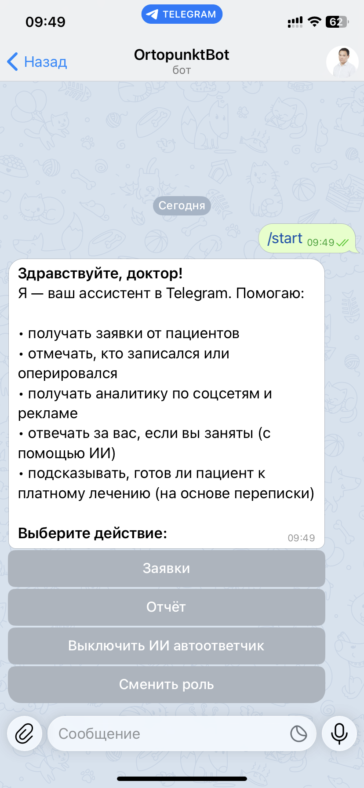
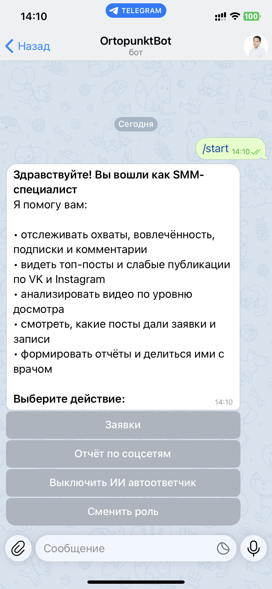
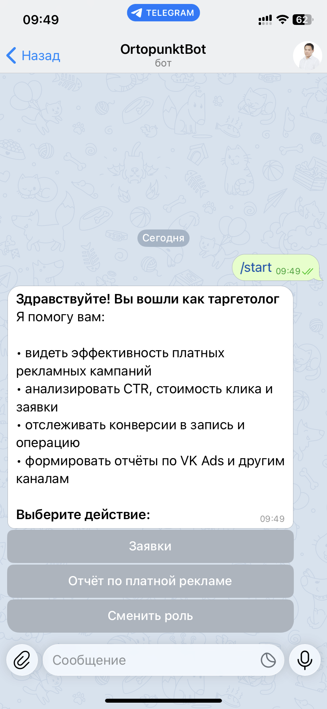
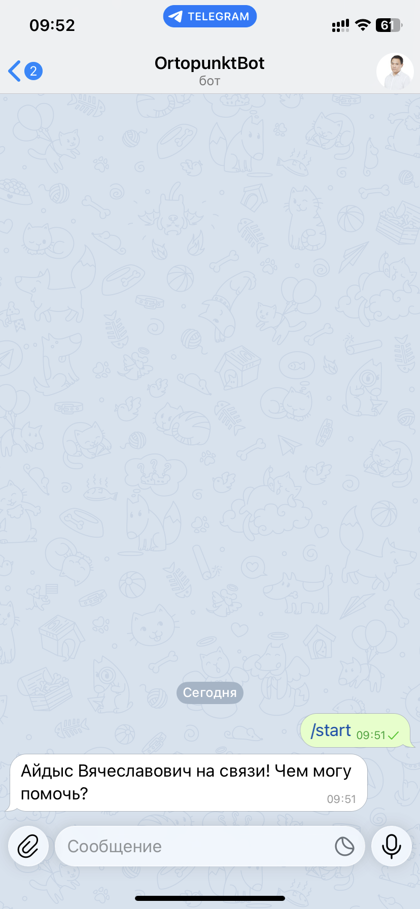

# **Ortopunkt_ru — CRM-system inside Telegram for a federal network of Medsi clinics**

  <a href="#project-description">Description</a> •
  <a href="#key-features">Features</a> •
  <a href="#technologies">Technologies</a> •
  <a href="#project-architecture">Architecture</a> •
  <a href="#documentation">Documentation</a> •
  <a href="#ai-models">AI Models</a> •
  <a href="#security">Security</a> •
  <a href="#contacts">Contacts</a>

## **Project Description**
A microservice CRM system built on Java 17 + Spring Boot and integrated directly into Telegram.

It allows you to:  
• receive requests and reply to patients;  
• use an AI assistant (auto-reply, message analysis);  
• collect and view omnichannel marketing analytics (VK, Instagram)

## **Key Features**
• **Telegram bot:** displays role-based menus; for patients — communication with the bot, for staff — internal functions and navigation (images are clickable)

  
  
  
  

• **CRM database:** receives applications from the bot; stores patients and their requests; allows changing statuses (reply, appointment, paid surgery or quota)

  
  
  
  

• **AI service:** answers automatically if staff didn’t have time; analyzes the text and helps gently guide the patient toward a paid surgery

  
  
  
  

• **Analytics:** builds funnels (from reply to surgery, paid/quota); collects omnichannel statistics from VK and Instagram; shows different reports for roles — SMM, targeting, doctor

  
  
  
  

## **Technologies**

Java 17 · Spring Boot · Spring Data JPA · PostgreSQL · Flyway · Docker Compose · TelegramBots API  
VK API · AI Models (NLI, Embeddings) · RestTemplate · Resilience4j · Swagger/OpenAPI · Actuator · Maven

## **Project Architecture**

The project consists of 7 modules separated by responsibility:  

• **tg-service** — user interface (Telegram UI: roles, menus, applications)  
• **crm-service** — system core: database, patients, applications, statuses  
• **ai-service** — AI logic: auto-replies and text analysis using NLI/Embeddings models  
• **analytics-service** — API + analytics processing (funnels, VK/Instagram statistics)  
• **common-dto** — shared DTOs for communication between services  
• **common-config** — shared configuration (RestTemplate, Resilience4j: retry, rate limiter)  
• **common-logging** — centralized logging

## Documentation

The project includes:
- structured REST documentation (Swagger / OpenAPI)
- a complete list of microservice endpoints
- request and response schemas for all DTOs
- error model and status codes

Full API documentation is available locally when the project is running (CRM-service → `/swagger-ui`)

## **AI Models**
• [**cross-encoder/nli-distilroberta-base**](ai-service/ai-nli/models/README.md) — NLI classifier: determines the intent of a message and helps choose the optimal response scenario  
• [**sentence-transformers/all-MiniLM-L6-v2**](ai-service/ai-embedder/models/README.md) — embedding model: generates semantic vectors for message analysis and similarity search

## **Security**

• AI models run locally (NLI + Embeddings), no data is sent to third-party services  
• Roles are assigned manually (only an administrator can grant access)  
• External APIs are used only for marketing statistics (VK/Instagram) and do not transmit personal data

## **Contacts**

- **LinkedIn:** [linkedin.com/in/anastasiazenkina](https://www.linkedin.com/in/anastasiazenkina/)
- **Telegram:** [@asizenkina](https://t.me/asizenkina)
- **Email:** asiazenkina@gmail.com
