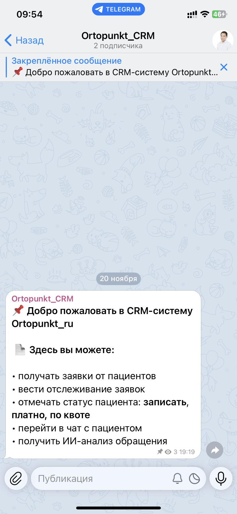
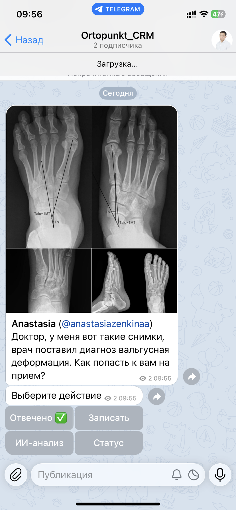
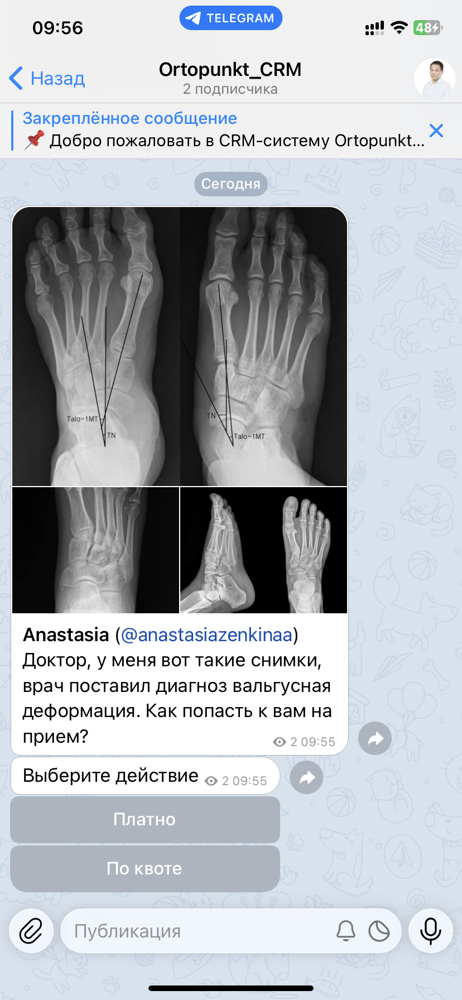
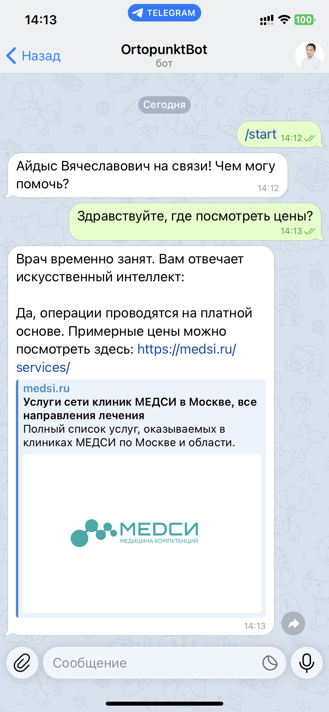
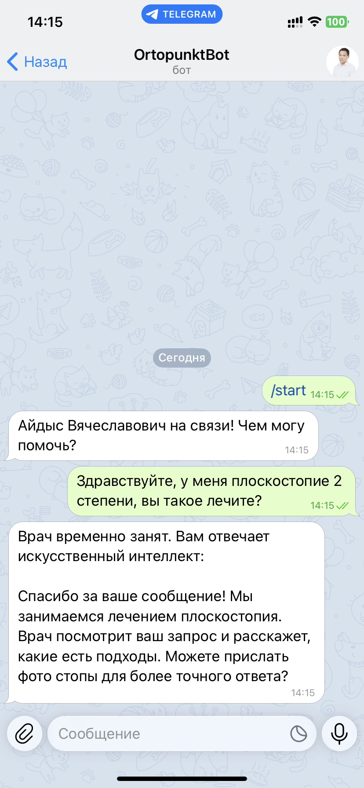
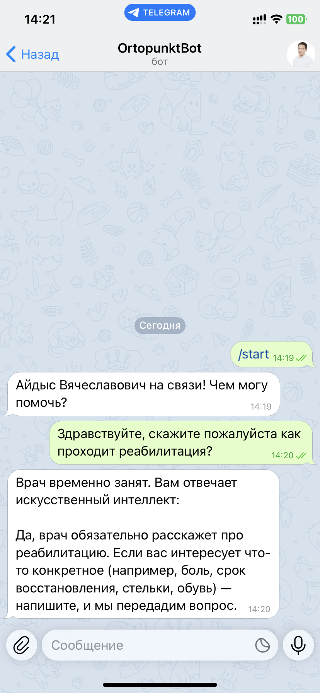
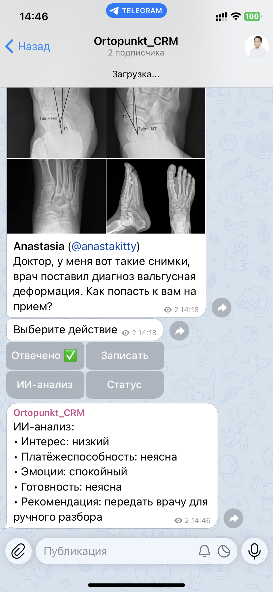
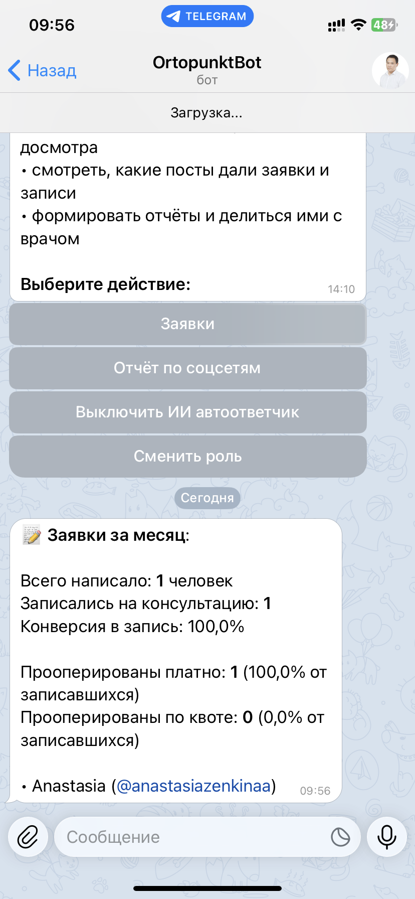
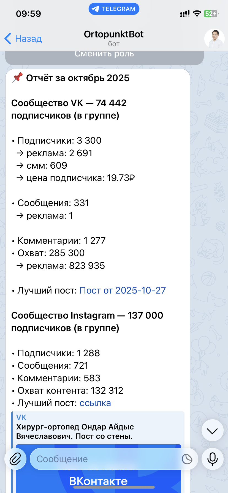
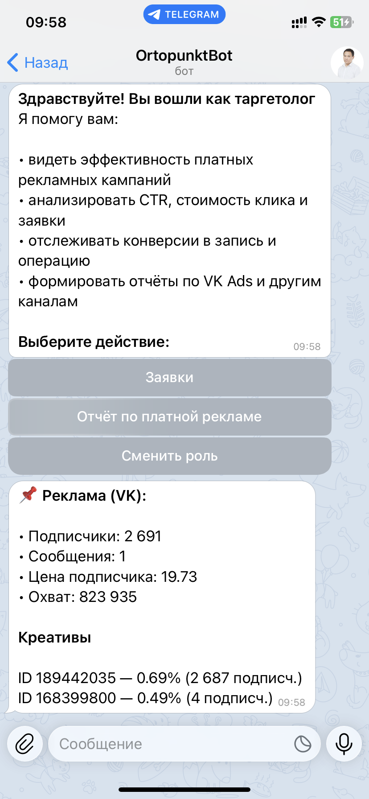

# **Ortopunkt_ru — CRM-система внутри Telegram для федеральной сети клиник Медси**

  <a href="#описание-проекта">Описание</a> •
  <a href="#основные-возможности">Возможности</a> •
  <a href="#технологии">Технологии</a> •
  <a href="#архитектура-проекта">Архитектура</a> •
  <a href="#ai-модели">AI-модели</a> •
  <a href="#безопасность">Безопасность</a> •
  <a href="#контакты">Контакты</a>

## **Описание проекта**
Микросервисная CRM-система на Java 17 + Spring Boot, встроенная в Telegram.

В ней можно:  
• принимать обращения и отвечать пациентам;  
• использовать ИИ-помощника (автоответчик, анализ сообщений);  
• собирать и смотреть омниканальную маркетинговую аналитику (VK, Instagram)

## **Основные возможности**
• **Telegram-бот:** показывает меню по ролям; для пациентов — общение с ботом, для персонала — свои функции и внутренняя навигация (изображения кликабельны)

  
  
  
  

• **CRM-база:** принимает обращения от бота; хранит пациентов и их заявки; позволяет менять статусы (ответ, запись к врачу, операция платно или по квоте)

  
  
  
  

• **ИИ-сервис:** отвечает автоматически, если сотрудник не успел; анализирует текст обращения и помогает мягко подвести пациента к платной операции

  
  
  
  

• **Аналитика:** строит срезы по базе (воронки от ответа до операции, платно/квота); собирает омниканальную статистику из VK и Instagram; показывает разные отчёты для ролей — СММ, таргет, врач

  
  
  
  

## **Технологии**

Java 17 · Spring Boot · Spring Data JPA · PostgreSQL · Flyway · Docker Compose · TelegramBots API  
VK API · AI Models (NLI, Embeddings) · RestTemplate · Resilience4j · Swagger/OpenAPI · Actuator · Maven

## **Архитектура проекта**

Проект состоит из 7 модулей, разделённых по зонам ответственности:  
• **tg-service** — пользовательский интерфейс (Telegram UI: роли, меню, заявки)  
• **crm-service** — ядро системы: база данных, пациенты, заявки, статусы  
• **ai-service** — ИИ-логика: автоответы и анализ текста на моделях NLI/Embeddings  
• **analytics-service** — API и обработка аналитики (воронки, VK/Instagram статистика)  
• **common-dto** — единые DTO для обмена между сервисами  
• **common-config** — общая конфигурация (RestTemplate, Resilience4j: retry, rate limiter)  
• **common-logging** — централизованное логирование

## **AI-модели**
• [**cross-encoder/nli-distilroberta-base**](ai-service/ai-nli/models/README.md) — классификатор смысла (NLI): определяет тип обращения и помогает выбирать оптимальный сценарий ответа  
• [**sentence-transformers/all-MiniLM-L6-v2**](ai-service/ai-embedder/models/README.md) — векторная модель: строит семантические эмбеддинги для анализа текста и подбора похожих сообщений

## **Безопасность**

• ИИ-модели работают локально (NLI + Embeddings), без отправки сторонним сервисам  
• Роли выдаются вручную (доступ может дать только администратор)  
• Внешние API используются только для маркетинговой статистики (VK/Instagram), без передачи персональных данных  

## **Контакты**

- **LinkedIn:** [linkedin.com/in/anastasiazenkina](https://www.linkedin.com/in/anastasiazenkina/)
- **Telegram:** [@asizenkina](https://t.me/asizenkina)
- **Email:** asiazenkina@gmail.com