# Ortopunkt_ru — CRM-система внутри Telegram для клиники Медси 2 на Красной Пресне

  <a href="#описание-проекта">Описание</a> •
  <a href="#основные-возможности">Возможности</a> •
  <a href="#технологии">Технологии</a> •
  <a href="#архитектура-проекта">Архитектура</a> •
  <a href="#документация">Документация</a> •
  <a href="#ai-модели">AI-модели</a> •
  <a href="#безопасность">Безопасность</a> •
  <a href="#контакты">Контакты</a>

## Описание проекта
Микросервисная CRM-система на Java 17 + Spring Boot, встроенная непосредственно в Telegram.

Позволяет:
• принимать заявки и отвечать пациентам;
• использовать AI-ассистента (автоответы, анализ сообщений);
• собирать и просматривать омниканальную маркетинговую аналитику (VK, Instagram).

Как продакт-менеджер я провела продуктовый discovery: выявила болевые точки травматологического отделения (время ответа — до 2 дней), сформулировала требования к CRM с учётом ролей (врач, SMM, таргетолог, администратор), приоритизировала функциональность по ценности для бизнеса и определила MVP — Telegram-бот с базовым функционалом и AI-автоответами.

## Основные возможности
• **Telegram-бот:** отображает ролевые меню — для пациентов общение с ботом, для сотрудников внутренние функции и навигация (изображения кликабельны)

  <a href="screenshots/doctor.PNG">
    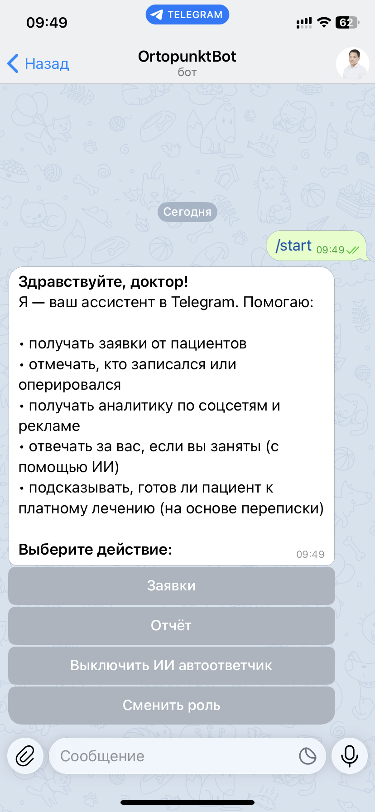
  </a>
  <a href="screenshots/smm.PNG">
    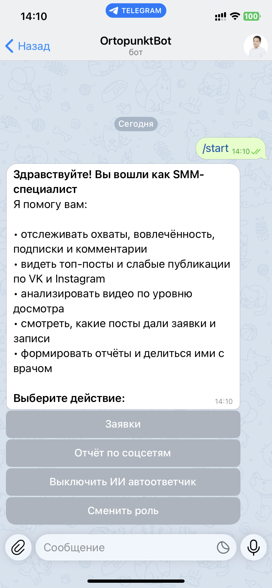
  </a>
  <a href="screenshots/target.PNG">
    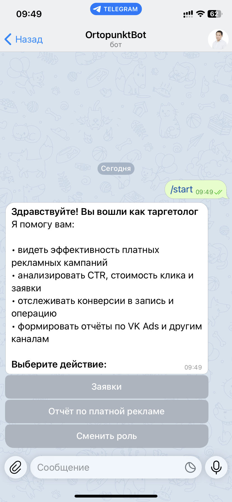
  </a>
  <a href="screenshots/patient.PNG">
    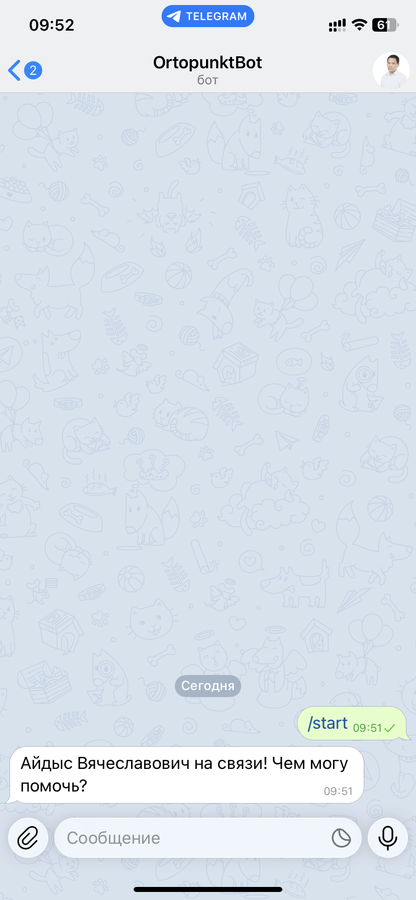
  </a>

• **CRM-база данных:** принимает заявки от бота, хранит пациентов и их обращения, позволяет менять статусы (ответили, запись, платная операция или квота)

  <a href="screenshots/crm_menu.PNG">
    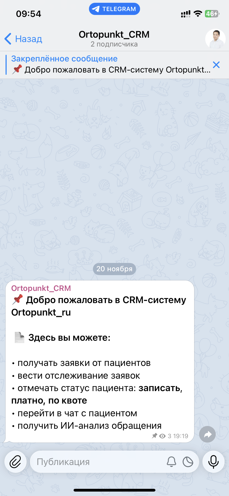
  </a>
  <a href="screenshots/crm_answered.PNG">
    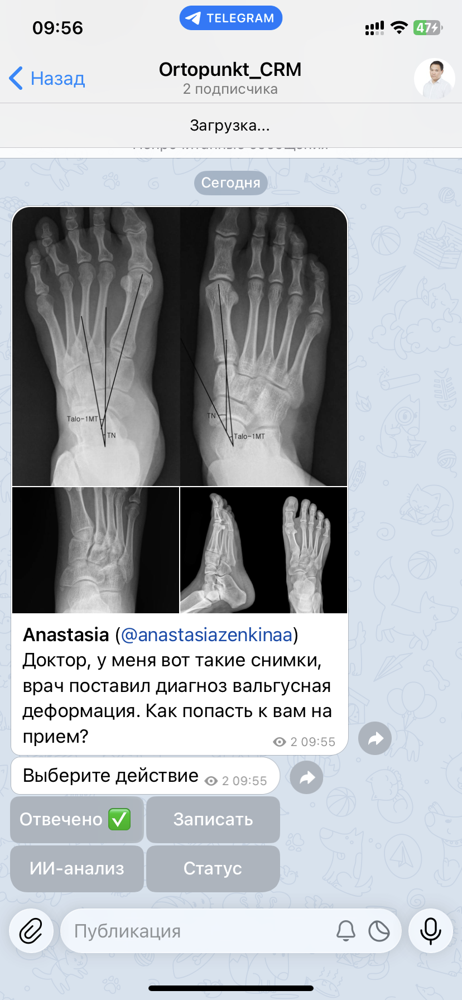
  </a>
  
  <a href="screenshots/crm_status.PNG">
    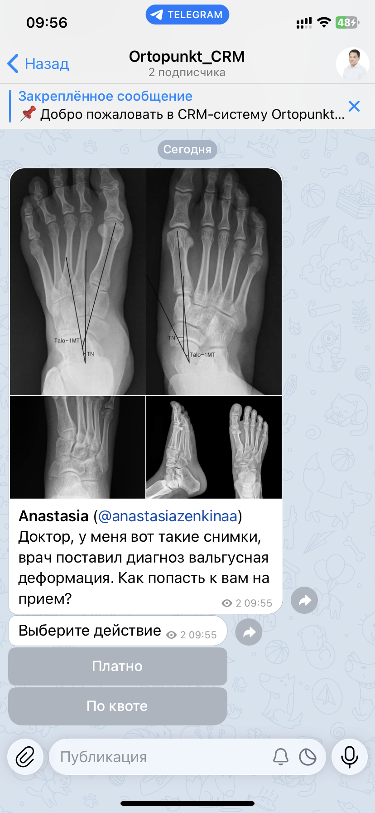
  </a>

• **AI-сервис:** отвечает автоматически, если сотрудник не успел; анализирует текст и помогает мягко подвести пациента к платной операции

  <a href="screenshots/ai_answers.PNG">
    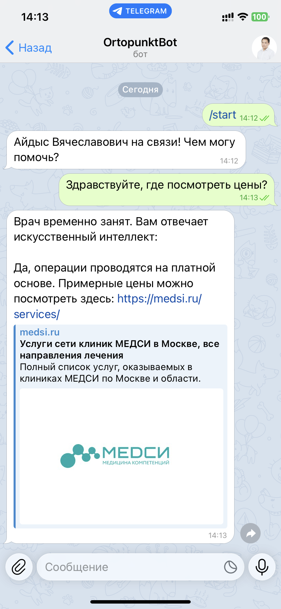
  </a>
  <a href="screenshots/ai_answers2.PNG">
    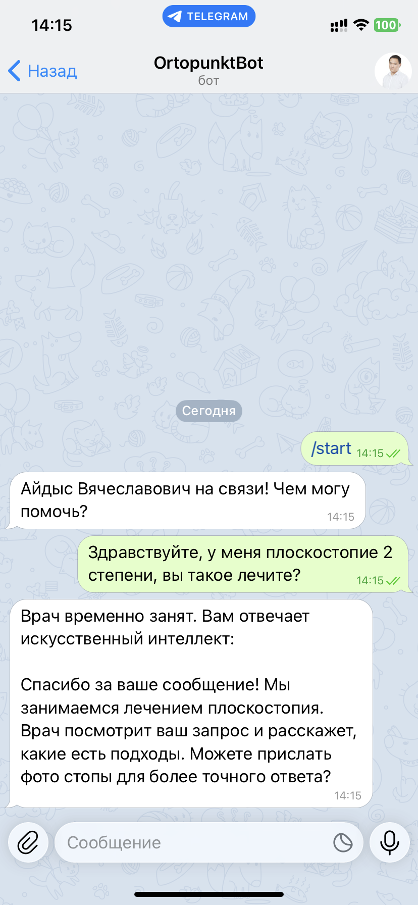
  </a>
  <a href="screenshots/ai_answers3.PNG">
    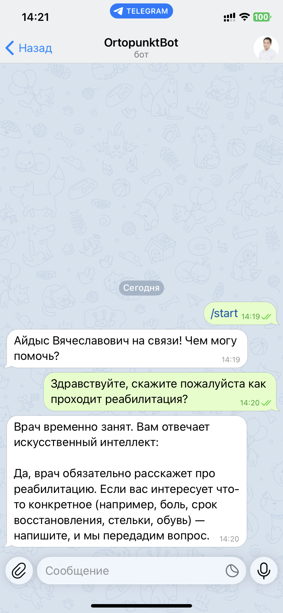
  </a>
  <a href="screenshots/ai_analysis.PNG">
    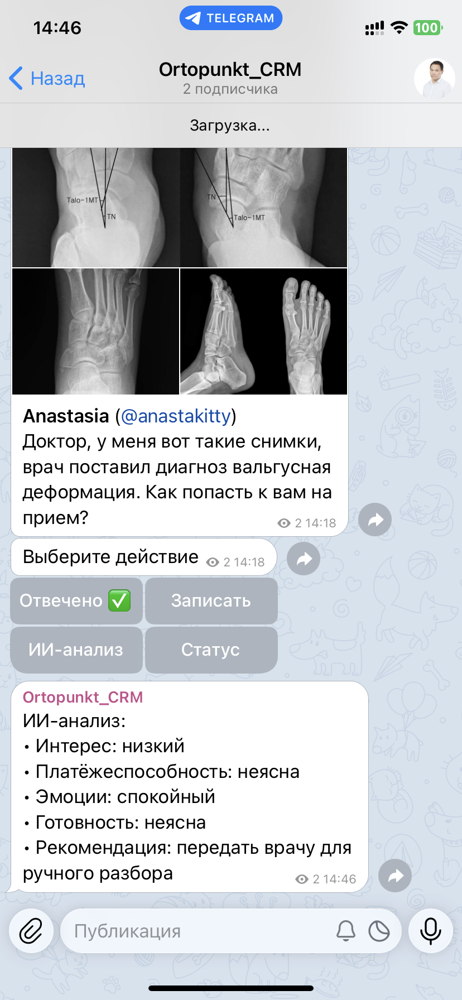
  </a>

• **Аналитика:** строит воронки (от ответа до операции — платной/по квоте), собирает омниканальную статистику из VK и Instagram, показывает разные отчёты для ролей — SMM, таргетолог, врач

  <a href="screenshots/application_analytics.png">
    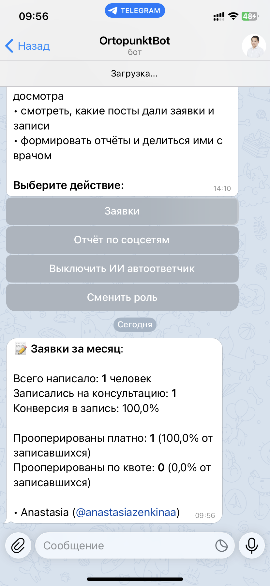
  </a>
  <a href="screenshots/doctor_analytics.png">
    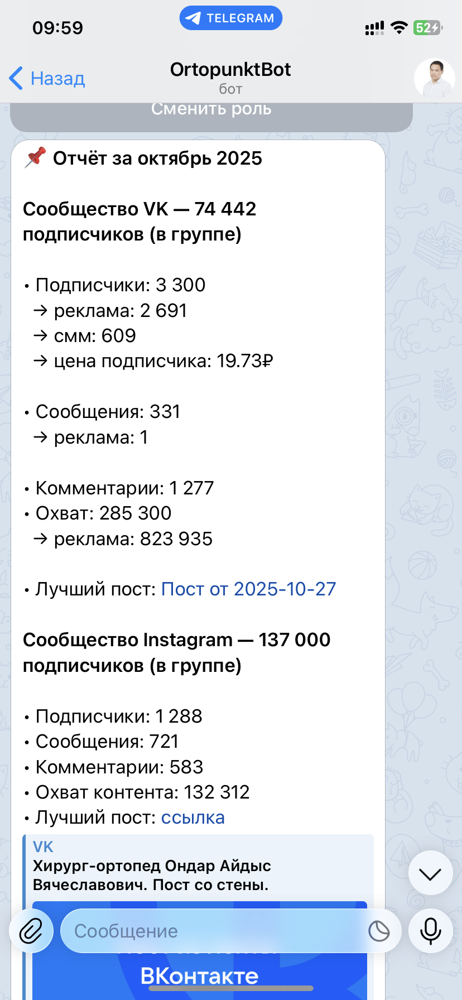
  </a>
  <a href="screenshots/target_analytics.png">
    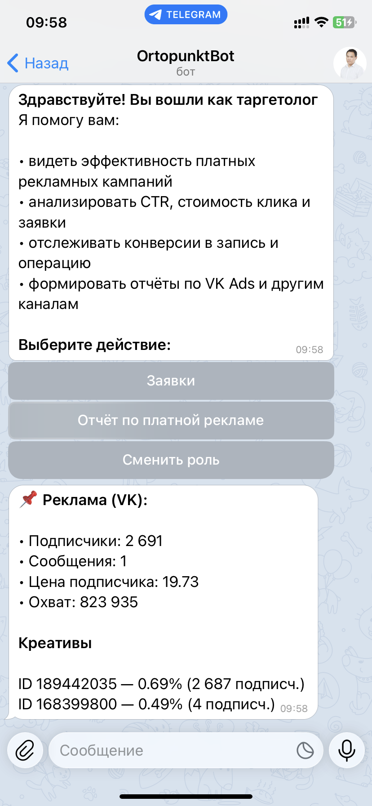
  </a>
  <a href="screenshots/smm_analytics.png">
    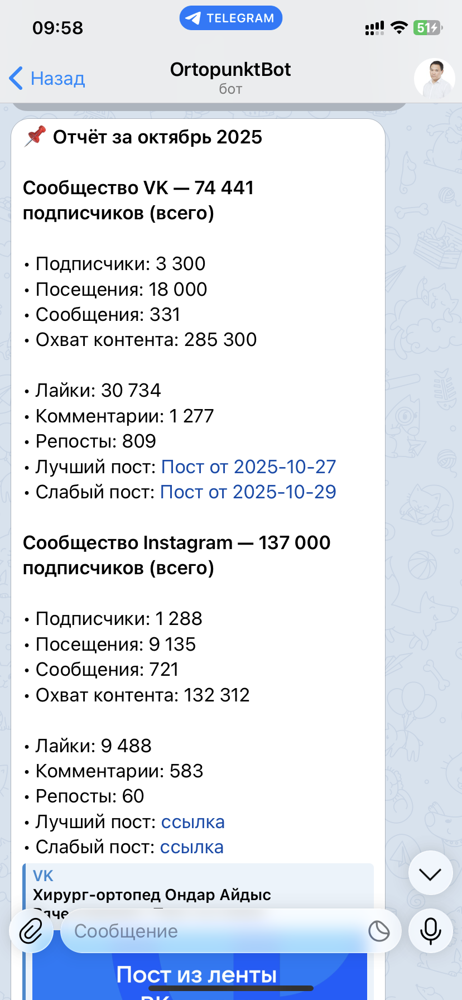
  </a>

**Бизнес-результаты, достигнутые благодаря продукту:**
- Время первого ответа пациенту сокращено с 2 дней до 10 минут.
- Автоматизация обработки заявок позволила врачам тратить на 70% меньше времени на рутинные ответы.
- Воронка показала рост конверсии из заявки в запись на 40% за счёт AI-подсказок и своевременных уведомлений.
- Омниканальная аналитика дала прозрачность по источникам трафика (VK, Instagram) и позволила перераспределить бюджет в пользу наиболее эффективных каналов.

## Технологии
Java 17 · Spring Boot · Spring Data JPA · PostgreSQL · Flyway · Docker Compose · TelegramBots API  
VK API · AI Models (NLI, Embeddings) · RestTemplate · Resilience4j · Swagger/OpenAPI · Actuator · Maven

С продуктовой точки зрения я выбрала микросервисную архитектуру для гибкости и масштабируемости, а также чтобы каждый сервис (TG, CRM, AI, Analytics) можно было развивать независимо. Решение использовать локальные AI-модели (NLI, Embeddings) вместо облачных API было принято из‑за требований к безопасности медицинских данных и снижения операционных расходов.

## Архитектура проекта
Проект состоит из 7 модулей, разделённых по ответственности:

• **tg-service** — пользовательский интерфейс (Telegram UI: роли, меню, заявки)  
• **crm-service** — ядро системы: БД, пациенты, заявки, статусы  
• **ai-service** — AI-логика: автоответы и анализ текста с использованием NLI/Embeddings  
• **analytics-service** — API + обработка аналитики (воронки, статистика VK/Instagram)  
• **common-dto** — общие DTO для связи между сервисами  
• **common-config** — общие конфигурации (RestTemplate, Resilience4j: retry, rate limiter)  
• **common-logging** — централизованное логирование

Как PM я определила логику статусной модели (ответили → запись → операция → оплата/квота) совместно с врачами и администраторами, чтобы она отражала реальный процесс. Также я проработала ролевую модель доступа и согласовала с командами SMM и таргета метрики для каждого отчёта, чтобы каждый пользователь видел только релевантные данные.

## Документация
Проект включает:
- структурированную REST-документацию (Swagger / OpenAPI)
- полный список эндпоинтов микросервисов
- схемы запросов и ответов для всех DTO
- модель ошибок и коды статусов

Полная документация API доступна локально при запуске проекта (CRM-service → `/swagger-ui`)

## AI-модели
• [**cross-encoder/nli-distilroberta-base**](ai-service/ai-nli/models/README.md) — NLI-классификатор: определяет намерение сообщения и помогает выбрать оптимальный сценарий ответа  
• [**sentence-transformers/all-MiniLM-L6-v2**](ai-service/ai-embedder/models/README.md) — эмбеддинг-модель: генерирует семантические векторы для анализа сообщений и поиска похожих обращений

Я протестировала несколько вариантов промптов и порогов уверенности для NLI, чтобы добиться баланса между точностью автоответов и безопасностью (чтобы AI не давал медицинских советов). Также настроила систему логирования всех AI-действий для аудита и дальнейшего улучшения модели на основе реальных диалогов.

## Безопасность
• AI-модели работают локально (NLI + Embeddings), данные не передаются сторонним сервисам  
• Роли назначаются вручную (только администратор может выдать доступ)  
• Внешние API используются только для маркетинговой статистики (VK/Instagram) и не передают персональные данные

Как PM я согласовала с юридическим отделом МЕДСИ политику обработки персональных данных, убедилась, что логи не содержат чувствительной информации, и обеспечила разделение доступа к аналитике в соответствии с ролью сотрудника.

## Контакты
[LinkedIn](https://linkedin.com/in/anastasiazenkina) · [Email](mailto:asiazenkina@gmail.com) · [Telegram](https://t.me/asiazenkina)
